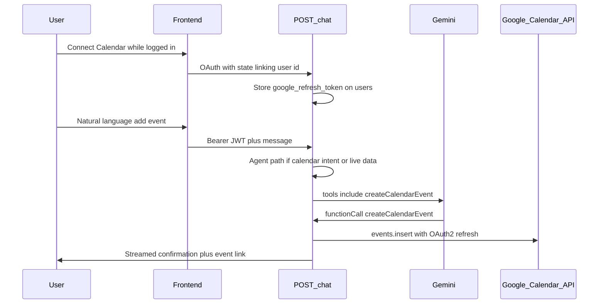

# Plan: Google Calendar agent tool (Wrangler)

Hand this document to an implementer. It describes how to let the Gemini agent **create events on the signed-in user’s Google Calendar** via a new tool, OAuth scope extension, and agent-path fixes.

**Stack context:** Node/Express backend (`server.js`), Gemini 2.5 Flash with function calling, Google OAuth in `auth.js`, Postgres in `db.js`, Next.js client in `client/`.

---

## Goals

- User can say things like “add a meeting Friday at 2pm to my calendar” and the assistant calls a **`createCalendarEvent`** tool that inserts into **Google Calendar** (`primary` calendar).
- Works only when the user is **signed in** and has completed **Connect Google Calendar** (refresh token stored).
- Calendar-only messages still enter the **agent loop** (tools), even when Tavily is not configured or the message does not match the existing “live data” regex.

---

## Why multiple files must change

1. **Agent path is gated too narrowly** — In `server.js`, tools run only when `needsLiveData && process.env.TAVILY_API_KEY`. Calendar intents often will not match `LIVE_DATA_PATTERN`, and calendar-only flows must not depend on Tavily.
2. **OAuth does not persist tokens** — `auth.js` receives `accessToken` / `refreshToken` from Google but only saves profile fields to `users`. The Calendar API needs a stored **refresh token** (with Calendar scope).
3. **`runAgentLoop` has no user context** — `/chat` decodes JWT to `chatUser` (`userId`, etc.) but the loop does not receive `userId`; the calendar handler must know which user’s token to use.

---

## Architecture (high level)

---

## Implementation steps

### 1. Database (`db.js`)

- Add nullable column on `users`, e.g. `google_refresh_token TEXT`.
- Use migration-safe SQL in `initDb`, e.g. `ALTER TABLE users ADD COLUMN IF NOT EXISTS google_refresh_token TEXT`.

### 2. Dependencies (`package.json`)

- Add **`googleapis`** for Calendar API calls.

### 3. OAuth: Calendar scope and refresh token (`auth.js`)

- Keep existing **`/auth/google`** for sign-in with `profile` + `email` only (no forced Calendar consent).
- Add a **separate** flow for calendar, e.g. `GET /auth/google/calendar` (and matching callback URL), for users **already logged in**:
  - Use `scope` including `https://www.googleapis.com/auth/calendar.events`.
  - Use `accessType: 'offline'` and `prompt: 'consent'` so Google issues a **refresh token** on first consent.
  - **State parameter:** encode or sign a payload that includes `userId` (from JWT), because the OAuth callback does not receive the `Authorization` header. Verify state in the callback and then `UPDATE users SET google_refresh_token = $1 WHERE id = $2`.
- Redirect back to `FRONTEND_URL` with a clear success or error query param.

**Security:** Treat refresh tokens as secrets; HTTPS in production; restrict DB access.

### 4. Calendar API module (new file, e.g. `googleCalendar.js`)

- Create `createCalendarEventForUser(userId, args)` (or similar):
  - Load `google_refresh_token` for `userId` from the database; if missing, return a clear error string for the model.
  - Configure OAuth2 with `GOOGLE_CLIENT_ID`, `GOOGLE_CLIENT_SECRET`, set credentials using the refresh token.
  - Call `calendar.events.insert` with `calendarId: 'primary'`.
- Args should map to API fields: `summary` (title), `start`/`end` with `dateTime` + `timeZone` (default `America/New_York` unless user specifies otherwise), optional `location`, `description`.
- Return a short success string including **`htmlLink`** from the response, or an error message.

### 5. Gemini tool and agent loop (`server.js`)

- Add **`createCalendarEvent`** to the tools definition (same Gemini `functionDeclarations` pattern as `webSearch`, `getDiningMenu`, etc.):
  - Required: `title`, `startDateTime`, `endDateTime` as ISO 8601 strings (or an equivalent unambiguous schema).
  - Optional: `location`, `description`, `timeZone`.
  - Description: use when the user wants to **create** a personal event on **their** Google Calendar (not for general UVA web search).
- In **`runAgentLoop`**, thread through **`userId`** (from JWT when present). Dispatch `createCalendarEvent` to the calendar module.
- Add a streamed status line for calendar tool execution (consistent with existing search/menu status lines).

**Agent path gating**

- Define **`CALENDAR_INTENT_PATTERN`** (regex), e.g. match: `calendar`, `google calendar`, `add to my calendar`, `remind me`, `create an event`, `put on my calendar`, `schedule a`, etc. Tune to reduce false positives.
- Set `calendarIntent = CALENDAR_INTENT_PATTERN.test(message)` (and optionally require signed-in user for calendar-only agent path).
- `useAgentTools = (needsLiveData && process.env.TAVILY_API_KEY) || (calendarIntent && …)` — do **not** require Tavily for calendar-only intent.
- **Conditionally build `tools`:** If `calendarIntent && !process.env.TAVILY_API_KEY`, pass **only** `createCalendarEvent` so web search/dining tools are not invoked without keys. If both calendar intent and Tavily are available, merge calendar into the existing `UVA_TOOLS` list.

### 6. System prompt (`uvadata.js`)

- Under **TOOL USE RULES**, document **`createCalendarEvent`** explicitly (same principle as `getDiningMenu` — the model must know the tool name).
- Instruct: parse times in **America/New_York** using **TODAY’S CONTEXT** from the prompt when the user says “Friday”, “tomorrow”, etc.; if time is missing, either ask one clarifying question or use a documented default (team choice).
- If calendar is not connected, tell the user to use **Connect Google Calendar** in the app.

### 7. Frontend (`client/pages/index.js`)

- When user has a JWT but no calendar token, show **Connect Google Calendar** linking to the backend route (with whatever `state` / query pattern the backend implements).
- Optionally extend **`GET /auth/me`** (or add `/auth/calendar/status`) to expose `calendarConnected: boolean` so the UI does not guess.

### 8. Google Cloud Console

- Enable **Google Calendar API** for the project.
- Add the **new redirect URI** for the calendar OAuth callback to the OAuth client.
- Ensure `BACKEND_URL` / callback URLs match Railway (or local) deployment.

---

## Files to touch

| Area | File |
|------|------|
| Tool schema, gating, `runAgentLoop` wiring | `server.js` |
| TOOL USE RULES | `uvadata.js` |
| OAuth routes, token persistence, optional `calendarConnected` | `auth.js` |
| Schema migration | `db.js` |
| Calendar API | New `googleCalendar.js` (name optional) |
| Connect button, optional status | `client/pages/index.js` |

---

## Testing checklist

- [ ] Logged-out user asks to add an event: assistant explains sign-in / connect (no server crash).
- [ ] Logged-in, calendar not connected: clear guidance to connect; tool returns friendly error if called anyway.
- [ ] Connected: event appears in Google Calendar; streamed reply includes confirmation / link.
- [ ] Message that is **only** calendar intent (no “live data” keywords) still uses the agent path and can call the tool.
- [ ] With Tavily unset, calendar-only messages still work (calendar-only tool list path).

---

## Optional follow-ups (out of scope unless requested)

- Encrypt `google_refresh_token` at rest.
- Attendees, reminders, or `sendUpdates` behavior.
- Update `CLAUDE.md` env var / deployment notes to mention Calendar API and new routes.
