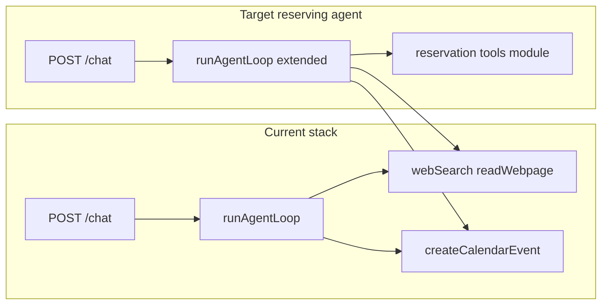

# Reserving agent plan (library and campus bookings)

## Constraints (important)

True **server-side automatic booking** (Wrangler completes the reservation in the student’s name without the student clicking through UVA’s site) generally requires one of:

- A **documented, patron-facing API** from the booking vendor (e.g. Springshare LibCal / similar) that UVA has enabled and that you are allowed to call, **or**
- Acting as the logged-in user via **SSO session** or **browser automation**, which is **fragile**, often **against terms of service**, and **unsafe** if you store NetBadge credentials.

Today the app already surfaces booking context in `[uvadata.js](uvadata.js)` (e.g. `lib.virginia.edu/spaces`, 2-week advance window) and triggers live search for reservation-like language in `[server.js](server.js)` (`reserv|book a room|study room` in `LIVE_DATA_PATTERN`). That path only **searches/read pages**—it does not complete a booking.

The plan below is written so **Phase 1–2 ship value without pretending bookings succeeded**, and **Phase 3** is explicitly gated on what UVA/vendor APIs actually allow.

---

## Phase 1: Reservation assistant tools (reliable, no false “booked” claims)

**Goal:** When the user asks to reserve a study room, AFC class slot, etc., the model uses **dedicated tools** with structured outputs instead of ad-hoc search only.

**Implementation sketch**

1. **New module** e.g. `[bookingAgent.js](bookingAgent.js)` (or `reservationTools.js`) exporting:
  - `getCampusBookingGuide({ category, venueHint, dateHint })` — wraps curated logic + optional `webSearch`/`readWebpage` for official URLs and policy text (max 1–2 reads per call to control cost/latency).
  - Returns a **structured object** (JSON string for Gemini): `{ system: "library"|"rec"|"other", primaryUrl, steps[], policies[], disclaimers[] }`.
2. **New Gemini function declaration(s)** in `[server.js](server.js)` (same pattern as `CALENDAR_TOOL_DECL`):
  - e.g. `getCampusBookingGuide` with enum or string `category`: `library_study_room`, `rec_fitness_class`, `meeting_space`, `other`.
  - Description must state: **“This tool does not complete a reservation; it returns official links and steps.”**
3. **Wire into `runAgentLoop`** in `[server.js](server.js)`: dispatch the new tool name alongside `webSearch`, `readWebpage`, `getDiningMenu`, `createCalendarEvent`.
4. **Intent gating** (mirror `[CALENDAR_INTENT_PATTERN](server.js)`):
  - Add `RESERVATION_INTENT_PATTERN` (reserve, book a room, study room, LibCal, lib.virginia.edu/spaces, AFC class signup, etc.).
  - Include reservation intent in the condition that enables the **full** tool set (with Tavily), or add a **reservation-only** mini toolset if you want it to work when Tavily is off (similar to `CALENDAR_ONLY_TOOLS`).
5. **System prompt updates** in `[uvadata.js](uvadata.js)`:
  - Instruct the model: never say “I booked it” unless a future `confirmBooking` tool returns success; for Phase 1 always say the user must **confirm on the official site** and paste the **primary URL**.
6. **Optional UX** in `[client/pages/index.js](client/pages/index.js)`:
  - If assistant message contains a known pattern (e.g. `https://lib.virginia.edu/spaces`), render a **“Open booking site”** button (same idea as the bus tracker marker), optional not required for backend-only milestone.

**Deliverable:** Students get accurate, repeatable guidance; fewer hallucinated bookings.

---

## Phase 2: Deep links and calendar handoff (still not API booking)

**Goal:** Reduce friction after Phase 1.

- **Research** (manual): For each target system (starting with **library spaces**), check whether URLs support **query parameters** (LibCal and similar sometimes support space-id or embed links). Document allowed patterns in code comments or `[CLAUDE.md](CLAUDE.md)`.
- **Tool enhancement:** Extend `getCampusBookingGuide` (or add `buildBookingDeepLink`) to return `deepLink` when a safe, documented pattern exists.
- **Calendar:** When the user confirms a time window, encourage `createCalendarEvent` to block **“Study room — confirm at …”** on their Google Calendar (already implemented in `[googleCalendar.js](googleCalendar.js)`); prompt text in `[uvadata.js](uvadata.js)` should tie reservation intent to calendar blocks.

**Deliverable:** One-click open of the right booking flow + calendar placeholder.

---

## Phase 3: Automated booking (gated; only if API/legal path exists)

**Goal:** Actually create a hold/reservation via API.

**Prerequisites (must be true before coding):**

- Written confirmation from vendor/docs that **patron booking** is allowed via API with the auth model you can use (service account vs user OAuth).
- UVA IT / library confirmation if needed.

**If LibCal (or similar) exposes a supported API:**

- Add server-side module e.g. `[libcalClient.js](libcalClient.js)` with env vars (`LIBCAL_CLIENT_ID`, `LIBCAL_CLIENT_SECRET`, or institution-specific tokens—exact names per vendor docs).
- New tool e.g. `createLibraryRoomReservation` with strict args: `spaceId`, `start`, `end`, `patronEmail` (must match signed-in user).
- **Auth:** Prefer **user-delegated OAuth** to the booking system if available; avoid storing NetBadge passwords.
- **Audit:** Log reservation attempts (DB table or structured logs): `user_id`, `tool`, `payload`, `vendor_response_id`, `created_at`.
- **Safety:** Rate limits, confirmation step in chat (“Confirm Shannon Library Room 204, Mar 25 2–4pm?”) before calling write API.

**If no API:**

- Do **not** implement headless browser automation in production; treat as out of scope and keep Phase 2 as the ceiling unless building a **local-only** demo with explicit user consent (still not recommended for Railway).

**Deliverable:** Real reservations only when backed by a real integration.

---

## Phase 4: Hardening and scope control

- **Tests:** Unit tests for reservation intent regex and tool routing; mock Gemini function responses for `getCampusBookingGuide`.
- **Policies:** Expand `[uvadata.js](uvadata.js)` with which venues are in-scope (libraries vs RecSports vs departmental rooms) and “out of scope — use Handshake / SIS / etc.”
- **Observability:** Log tool errors from `runAgentLoop` for booking tools to debug Tavily vs parsing failures.

---

## Files likely touched (summary)

| Area               | Files                                                                                               |
| ------------------ | --------------------------------------------------------------------------------------------------- |
| Tools + agent loop | `[server.js](server.js)`, new `bookingAgent.js` (or similar)                                        |
| LLM behavior       | `[uvadata.js](uvadata.js)`                                                                          |
| Optional UI        | `[client/pages/index.js](client/pages/index.js)`                                                    |
| Phase 3 only       | new vendor client module, `[db.js](db.js)` migrations for audit log, `[.env.example](.env.example)` |

---

## Recommendation

Ship **Phase 1 + 2** as “Reserving Agent v1” for the hackathon: strong guidance, official links, optional calendar blocks, honest language about confirmation. Treat **Phase 3** as a follow-on **only after** confirming a real API path with UVA’s booking stack.