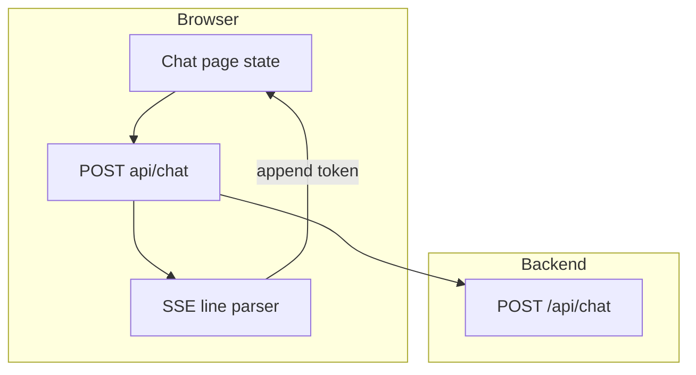

# Wrangler frontend — full description for porting

Use this as a spec to recreate the UI/UX in another codebase (e.g. plain React + JS, or Vite). The implementation here is **Next.js 16 App Router** + **React 19** + **Tailwind CSS v4** + **TypeScript** (strip types for JS).

---

## Stack and dependencies

| Piece                       | Role                                                                                                        |
| --------------------------- | ----------------------------------------------------------------------------------------------------------- |
| **Next.js 16** (App Router) | `layout.tsx` + `page.tsx` under `src/app/`                                                                  |
| **React 19**                | Client chat UI (`"use client"`)                                                                             |
| **Tailwind CSS v4**         | `@import "tailwindcss"` in CSS; theme via `@theme inline` (no classic `tailwind.config.js` in this project) |
| **next/font/google**        | Geist Sans, Geist Mono, **Rye** (display / Wild West headline font, weight 400)                             |
| **react-markdown**          | Renders assistant messages as Markdown (links, lists, bold, tables, code)                                   |

**npm packages (runtime):** `next`, `react`, `react-dom`, `react-markdown`

**Dev:** `@tailwindcss/postcss`, `tailwindcss`, `postcss` (as created by `create-next-app`), ESLint + `eslint-config-next`

**Dev script note:** `[apps/web/package.json](apps/web/package.json)` uses `next dev --hostname 127.0.0.1 --port 3000` to avoid some local dev / Chrome issues; optional for another host.

---

## Environment variable (frontend)

- `**NEXT_PUBLIC_API_URL`** — Base URL of the chat API **without** a trailing slash (e.g. `http://127.0.0.1:3001` or production Railway URL).
- In code: `process.env.NEXT_PUBLIC_API_URL` with fallback `http://127.0.0.1:3001`.
- **Important for JS port:** Whatever replaces this must be available in the **browser** (e.g. `import.meta.env.VITE_`* in Vite, or `window.__API_URL__` if injected).

---

## File map

| File                                                           | Purpose                                                                 |
| -------------------------------------------------------------- | ----------------------------------------------------------------------- |
| `[apps/web/src/app/layout.tsx](apps/web/src/app/layout.tsx)`   | Root HTML shell, fonts, metadata                                        |
| `[apps/web/src/app/globals.css](apps/web/src/app/globals.css)` | Tailwind v4 theme colors + scrollbar + `.prose-western` markdown styles |
| `[apps/web/src/app/page.tsx](apps/web/src/app/page.tsx)`       | Entire chat UI + SSE client                                             |
| `[apps/web/postcss.config.mjs](apps/web/postcss.config.mjs)`   | Tailwind PostCSS pipeline (default from template)                       |

`[next.config.ts](apps/web/next.config.ts)` is default (no custom images/domains required for this UI).

---

## Layout and typography (`[layout.tsx](apps/web/src/app/layout.tsx)`)

- `**html`:** `lang="en"`, `h-full`, class list applies three CSS variables: `--font-geist-sans`, `--font-geist-mono`, `--font-rye`.
- `**body`:** `h-full`, no extra wrapper — the page fills the viewport.
- **Fonts:** Geist + Geist Mono (default weights/subsets latin); **Rye** only at weight `400`, variable `--font-rye`.
- **Metadata:** title `Wrangler — UVA Campus Guide`; description mentions UVA topics (dining, buses, etc.).

**Porting tip:** In non-Next apps, load **Rye** from Google Fonts and use it for “WRANGLER” and “Howdy, partner”; use a clean sans (e.g. Geist or Inter) for body.

---

## Global styles and design system (`[globals.css](apps/web/src/app/globals.css)`)

### Tailwind v4 `@theme inline` (custom colors + font aliases)

These become utility classes like `bg-desert`, `text-brass`, `font-display`:

- **Semantic colors**
  - `parchment` `#f5e6c8`, `parchment-dim` `#b8a88a`
  - `leather` `#8b4513`, `leather-light` `#a0522d`
  - `brass` `#c9a84c`, `brass-dim` `#a08530`
  - `desert` `#1a1008`, `desert-light` `#2d1b08`, `desert-border` `#3d2b18`
- `**--font-sans` / `--font-mono` / `--font-display`** wired to the Next font CSS variables.

### `:root` + `body`

- Page background `#1a1008`, default text `#f5e6c8` (parchment).
- `body` uses `var(--font-sans)` with system-ui fallback.

### Scrollbar (WebKit)

- Narrow track, thumb color `#3d2b18`, rounded.

### `.prose-western` (Markdown inside assistant bubbles)

Scoped typography for content inside `
`:

- Vertical rhythm (`> * +` * margin)
- Lists: padded left, disc/decimal
- Links: brass color, underline, lighter on hover
- `strong`, `code`, `pre`, `h1–h4` sizes, **tables** with `#3d2b18` borders, `blockquote` with left brass border

**Porting tip:** If you use Tailwind v3, map the same hex values to `theme.extend.colors` and use arbitrary classes or `@apply` in a `.prose-western` block.

---

## Page structure and UX (`[page.tsx](apps/web/src/app/page.tsx)`)

### Client component

- Top of file: `"use client"` so hooks and `fetch` run in the browser.

### Data model

- `**messages`:** array of `{ role: "user" | "model", content: string }`.
- `**input`:** controlled textarea string.
- `**isStreaming`:** boolean; disables send and drives loading dots.
- `**scrollRef`:** on the scrollable message list; `**textareaRef`** for auto-grow height.

### Scroll behavior

- `useEffect` runs `scrollToBottom` whenever `messages` changes so new content stays in view.

### Textarea auto-resize

- On change: reset height to `auto`, then set to `min(scrollHeight, 160px)`.

### Suggested prompts (empty state)

Constant array of 6 short UVA-themed strings; each is a pill **button** that calls `sendMessage(s)` directly.

### API contract (must match your backend)

- **POST** `${API_URL}/api/chat`
- **Headers:** `Content-Type: application/json`
- **Body:** `{ messages: ChatMessage[] }` where the **last** message is the new **user** turn; prior entries are full conversation history (alternating user/model with real content — **do not** send a trailing empty assistant message; the UI builds `updated = [...messages, userMsg]` only for the request).

### Streaming protocol (SSE-style)

- Response: `text/event-stream` (or any stream the backend sends in this shape).
- Client reads `response.body` with `**ReadableStream` + `getReader()` + `TextDecoder`**.
- Lines starting with `data:` ; payload after prefix is JSON `**{ "token": "..." }`** **or** literal `[DONE]` end marker.
- Append `parsed.token` to the **last** message in state (the empty assistant bubble added optimistically).
- Malformed JSON lines: ignored (inner try/catch).

### Optimistic UI flow

1. Append user message to state.
2. Append assistant message with `content: ""`.
3. Clear input, reset textarea height, set streaming true.
4. On each token, update last message’s `content` by concatenation.
5. `finally`: set streaming false.

### Error handling

- `!res.ok` → throw with status (caught below).
- Network errors (`TypeError` + message `Failed to fetch` or `Load failed`): replace assistant bubble with friendly copy + **Markdown** hint (bold + backticks) telling user to run the API locally and showing `API_URL`.

### Keyboard

- **Enter** (without Shift): prevent default, send.
- **Shift+Enter**: new line in textarea.

---

## Visual layout (regions)

All inside `**main`:** `flex flex-col h-dvh bg-desert` (full dynamic viewport height, dark brown background).

1. **Header** (`shrink-0`): bottom border `desert-border`, semi-transparent `desert-light/50`, `backdrop-blur-sm`, inner `max-w-3xl` centered. **“WRANGLER”** in `font-display text-2xl tracking-wide text-brass`. Subtitle “Your UVA Campus Guide” in small `parchment-dim`.
2. **Middle (conditional)**
  - **No messages:** centered column — huge “Howdy, partner” (`font-display text-5xl/6xl text-brass`), subtitle paragraph, wrap of suggestion chips (`rounded-full border`, hover brass).
  - **Has messages:** scrollable column (`flex-1 overflow-y-auto`), inner `max-w-3xl space-y-4`. Each row: `flex justify-end` (user) or `justify-start` (assistant).
3. **Message bubbles**
  - **User:** `max-w-[85%] sm:max-w-[75%]`, `rounded-2xl`, `bg-leather text-parchment`, plain `
` with `whitespace-pre-wrap break-words`.
  - **Assistant:** same max-width/rounding, `border border-desert-border bg-desert-light`, content is either:
    - **Loading:** three `.` spans with `animate-bounce` and staggered `[animation-delay:…]` in `text-brass`, when `content === "" && isStreaming`
    - **Done:** `ReactMarkdown` inside `.prose-western`
4. **Footer (input)** (`shrink-0`): top border, same frosted bar as header. Form: `max-w-3xl`, flex row, `**items-end`**. Textarea: `flex-1`, `rounded-xl`, `border-desert-border`, `bg-desert`, `text-parchment`, placeholder `parchment-dim`, `focus:border-brass`. Submit: square `h-12 w-12`, `bg-brass text-desert`, hover `brass-dim`, disabled when empty or streaming — **paper-airplane** SVG (Heroicons-style path from inline SVG). Below: disclaimer line `text-xs text-parchment-dim/60` (not official UVA).

---

## Mermaid: UI data flow

---

## Checklist for a JavaScript port

1. Recreate **colors** and **fonts** (especially Rye for headings).
2. Single-page **chat** with the same **message shape** and **POST body** shape.
3. Implement **SSE/stream reader** exactly as above if the backend matches.
4. Use **markdown renderer** for assistant text + the `**.prose-western`** rules (or equivalent).
5. Wire **public env** for API base URL; avoid mixing `localhost` vs `127.0.0.1` if you hit browser fetch issues.
6. Optional: same **suggestion chips**, **disclaimer**, **loading dots**, **auto-scroll**, **textarea grow**.

No backend changes are required if your API already implements the same `/api/chat` JSON + SSE token format.